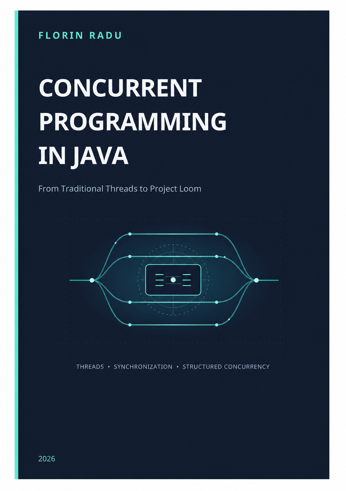

<p align="center">
  
</p>

<h1 align="center">Concurrent Programming in Java</h1>

<p align="center">
  <strong>From Traditional Threads to Project Loom</strong>
</p>

<p align="center">
  Code examples and companion material for the book by <strong>Florin Radu</strong>.
</p>

---

## About the Book

**Concurrent Programming in Java: From Traditional Threads to Project Loom** is a practical introduction to concurrent programming with modern Java.

The book starts with the foundations of threads, shared state, synchronization, and thread safety, then gradually moves toward higher-level concurrency abstractions and the mechanisms introduced in recent Java versions.

The focus is not only on how Java concurrency APIs work, but also on how to design concurrent programs that are correct, understandable, and maintainable.

Topics include:

- threads and thread lifecycle;
- shared state and race conditions;
- synchronization and intrinsic locks;
- thread safety;
- deadlocks and strategies for avoiding them;
- atomic operations;
- concurrent collections;
- producer-consumer patterns;
- thread pools and `ExecutorService`;
- `Callable` and `Future`;
- asynchronous programming with `CompletableFuture`;
- task coordination;
- virtual threads;
- structured concurrency;
- practical patterns for building safer and more scalable concurrent applications.

---

## About This Repository

This repository contains the **runnable Java examples** associated with the book.

The examples are organized to follow the structure of the book, making it easy to move from the explanation of a concept to the corresponding implementation.

Where the book uses short code fragments to illustrate an idea, this repository may provide complete runnable programs so that the examples can be compiled, executed, modified, and explored independently.

In addition to the examples presented in the book, the repository includes an `extra` package containing more advanced examples based on practical, real-world scenarios. These examples complement the chapter-based material by combining multiple concurrency mechanisms in larger applications.

The repository can be used as:

- companion material while reading the book;
- a collection of practical Java concurrency examples;
- teaching material for Java and concurrent programming courses;
- a starting point for experimenting with concurrency mechanisms.

---

## Repository Structure

The source code is organized by chapter and section, while additional real-world examples are placed in the `extra` package.

A typical structure is:

```text
src/main/java/
└── ro/florinradu/concurrentjava/
    ├── chapter02/
    │    ├── section03/
    │    ├── section05/
    │    └── ...
    ├── chapter03/
    ├── chapter04/
    ├── ...    
    └── extra/
         └── ...
```

The exact package structure may evolve as examples are refined or new material is added.

---

## Extra Examples

The `extra` package contains larger examples based on practical, real-world scenarios:

- `future` — retrieves cryptocurrency market data using `ExecutorService` and `Future`;
- `completablefuture` — retrieves weather data asynchronously using `CompletableFuture`;
- `producerconsumer` — converts text files to PDF documents using a producer-consumer pipeline;
- `virtualthreads` — checks multiple websites concurrently using virtual threads;
- `structuredconcurrency` — builds a GitHub dashboard from several related API calls using `StructuredTaskScope`;
- `ratelimiter` — limits concurrent access to an external service using `Semaphore`.

These examples are intended to complement the smaller chapter-based examples by showing how concurrency mechanisms can be used in complete applications.

---

## Important Notes

Some examples intentionally demonstrate incorrect or non-terminating concurrent behavior, such as deadlock, livelock, race conditions, busy waiting, or starvation. Run these examples individually and read the corresponding book section before using them as implementation patterns.

Because concurrent execution is inherently nondeterministic, the order of messages or intermediate results may vary between runs.

Some examples in the extra package access public Internet services. Their availability, response times, and API behavior are outside the control of this repository and may change over time.

The producer-consumer example includes ready-to-use text files in the samplefiles directory and writes the generated PDF files to the selected directory.

---

## Running the Examples

Clone the repository:

```bash
git clone https://github.com/florin2radu/concurrent_programming_in_java.git
cd concurrent_programming_in_java
```

Open the project in your preferred Java IDE, such as:

- IntelliJ IDEA
- Eclipse
- Visual Studio Code with the Java extensions

Configure JDK 25 as the project SDK. The project includes the required preview configuration for structured concurrency examples; if your IDE does not detect it automatically, enable preview features manually.

The chapter-based examples use only the Java standard library and can be run individually from the IDE. Some examples in the `extra` package use additional dependencies declared in `pom.xml`. 
When importing the repository as a Maven project, the IDE should resolve these dependencies automatically. The complete project can also be compiled with:

```bash
mvn clean compile
```

---

## Learning by Experimentation

Concurrency is difficult to learn only from definitions.

The examples in this repository are therefore designed to encourage experimentation. Try modifying them by:

- increasing the number of threads;
- removing synchronization;
- changing task execution strategies;
- introducing artificial delays;
- replacing platform threads with virtual threads;
- comparing sequential and concurrent execution;
- observing race conditions and deadlocks;
- experimenting with different executor configurations.

Many concurrency concepts become much clearer when their behavior can be observed directly.

---

## The Book

**Concurrent Programming in Java: From Traditional Threads to Project Loom**

**Author:** Florin Radu

The book is available in digital format through major publishing platforms.

- **Amazon Kindle** — coming soon
- **Leanpub** — https://leanpub.com/concurrentprogramminginjava
- **Google Play Books** — coming soon

---

## Who Is This Book For?

The book is intended for:

- Java developers who want to understand concurrent programming;
- students studying Java, operating systems, real-time systems, or software engineering;
- developers preparing to use virtual threads and modern Java concurrency;
- programmers who know basic Java and want to move beyond sequential applications;
- instructors looking for practical concurrency examples for teaching.

A basic understanding of Java programming is recommended.

No previous experience with concurrent programming is required.

---

## About the Author

**Florin Radu** has worked as a software engineer and consultant in the software industry for approximately 15 years.

He has also been teaching at a technical university in Romania for 19 years, with a focus on software engineering, real-time systems and related computer engineering topics.

His professional and academic experience has shaped the practical approach of this book: concepts are introduced progressively, with an emphasis on understanding how concurrency mechanisms behave in real programs.

---

## Updates

This repository may be updated as:

- errors are corrected;
- examples are improved;
- new Java versions introduce relevant concurrency features;
- additional examples are added to complement the material in the book.

Readers are encouraged to check the repository for the latest version of the examples.

---

## License

The source code in this repository is provided as companion material for the book.

The source code in this repository is licensed under the [Apache License 2.0](LICENSE).

The text, figures, and other content of the book are not covered by the source-code license.

---

## Stay Updated

If you find the examples useful, you can **star this repository** to make it easier to find and to follow future updates.

For corrections, suggestions, or questions related to the examples, please use the repository's **Issues** section.

---

<p align="center">
  <strong>Concurrent programming is not only about running tasks at the same time.<br>
  It is about coordinating them correctly.</strong>
</p>
